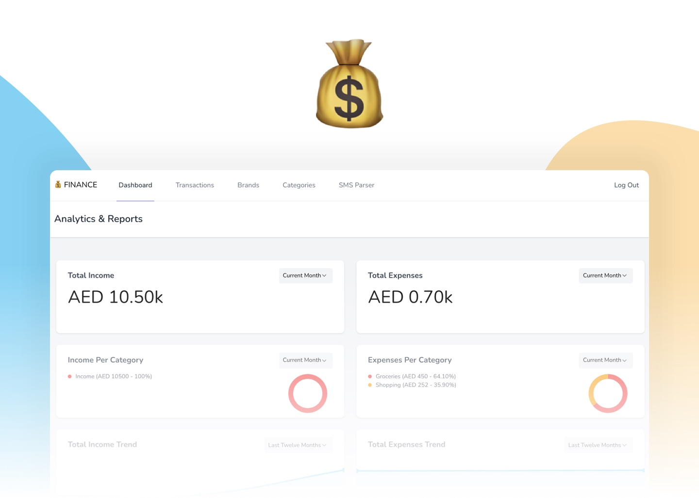
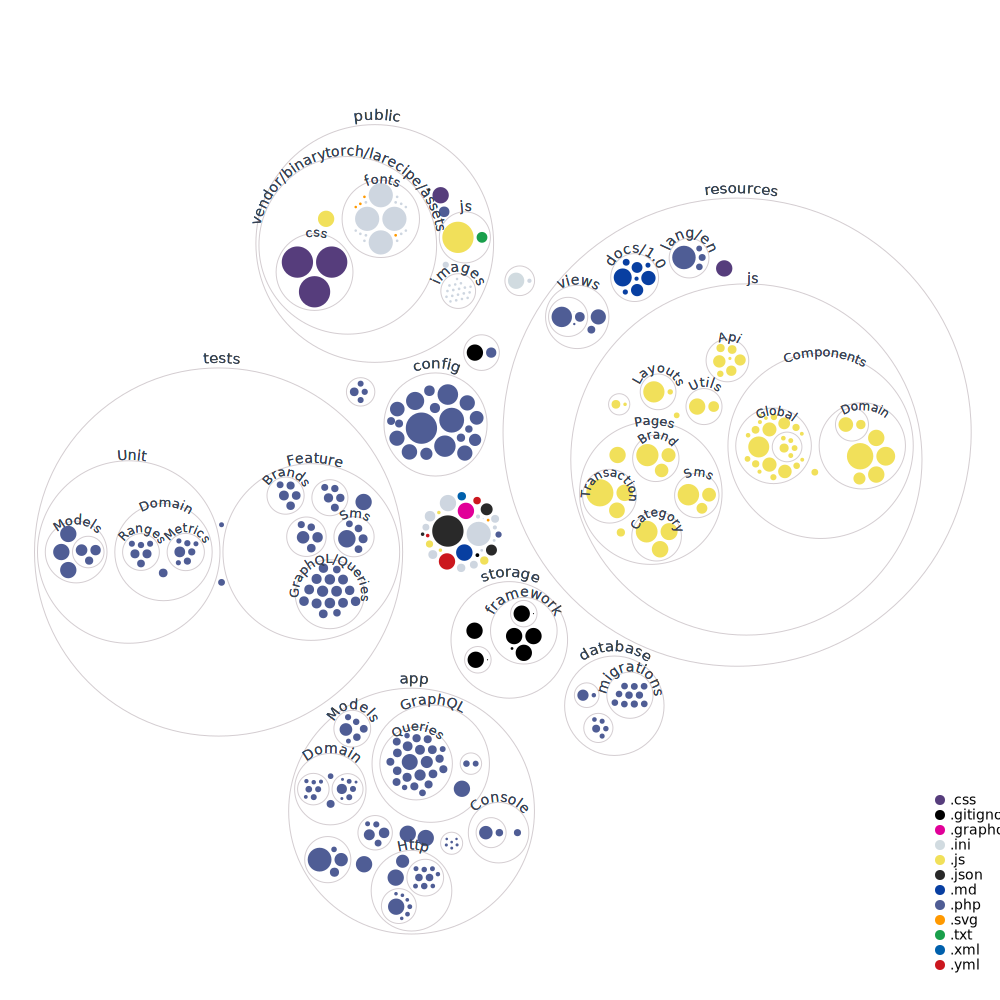

<h1 align="center">FINANCE</h1>

<p align="center">
  <b>FINANCE is a simple yet powerful, self-hosted personal finance tracking web app with the ability to parse SMS transactions and generate very useful insights about your money</b>
</p>

<p align="center"><a href="https://www.youtube.com/watch?v=kfwcMdlFn9o&list=PLw5MK6ws-o1_rNobmZCmnH5G11vwCiKKk&ab_channel=ILoveMathAcademy" target="__blank"></a></p>
<p align="center"><a href="https://www.youtube.com/watch?v=kfwcMdlFn9o&list=PLw5MK6ws-o1_rNobmZCmnH5G11vwCiKKk&ab_channel=ILoveMathAcademy" target="__blank"></a></p>

## 💰 Sponsors
Support this project by becoming a sponsor ❤️. Your logo will show up here with a link to your website. [Become a sponsor](https://github.com/sponsors/saleem-hadad)

## 🛠 Features

1. [x] Self-hosted - full control over your data privacy 
2. [x] Parse SMS bank transactions
3. [x] Detailed analysis of income and expenses
4. [x] Detailed monthly report of income and expenses - [see example](https://github.com/saleem-hadad/finance/pull/4)

## 🎮 Demo

Try the app with [live demo](https://finance-demo.saleem.dev/).

## ▶️ Installation 

> Docker Installation

```bash
# step 1: clone the repo
git clone https://github.com/saleem-hadad/finance && cd finance

# step 2: create .env file
cp .env.sail.example .env

# step 3: install deps via composer
docker run --rm \
    -u "$(id -u):$(id -g)" \
    -v $(pwd):/var/www/html \
    -w /var/www/html \
    laravelsail/php81-composer:latest \
    composer install --ignore-platform-reqs

# step 4: serve the app
./vendor/bin/sail up -d

# step 5: generate app key
./vendor/bin/sail artisan key:generate

# step 6: run migration
./vendor/bin/sail artisan migrate

# step 7: run install command and follow the instructions
./vendor/bin/sail artisan finance:install
```

Once done, visit the app on `http://localhost`


> Normal Laravel App

If you wish installing the app using normal Laravel environment, make sure you have PHP, MySQL, and composer already installed and then run the following commands:

```bash
# step 1: clone the repo
git clone https://github.com/saleem-hadad/finance && cd finance

# step 2: create .env file
cp .env.example .env

# step 3: install deps via composer
composer install

# step 4: generate app key
php artisan key:generate

# step 5: run the migration
php artisan migrate

# step 6: run install command and follow the instructions
php artisan finance:install

# step 7: serve the app
php artisan serve
```

Once done, visit the app on `http://localhost:8000`


Read [full documentation](https://finance-demo.saleem.dev/docs)

## 🪚 Built with

1. Laravel
2. Inertia & ReactJs
3. GraphQL
4. MySQL
5. Docker

## JetBrains Sponsorship
Thank you, JetBrains for sponsoring the license ❤️

<a href="https://www.jetbrains.com/community/opensource/#support" target="__blank">

</a>

## Project Visualization



## 🔖 License

This project is licensed under the MIT License - see the [LICENSE.md](https://github.com/saleem-hadad/finance/blob/main/LICENSE) file for details.
